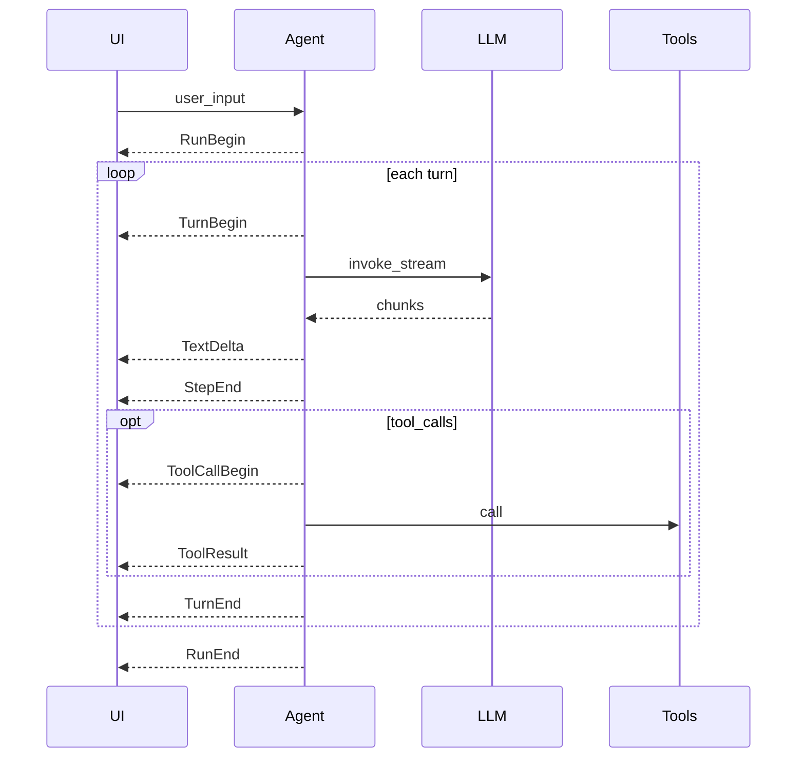

# Agent events

Language: [简体中文](/zh/events) | [日本語](/ja/events) | [四川话](/sc/events) | English

For developers building custom UIs. New users: [Quick start](./guide/quick-start); internals: [development.md](./development.md).

Structured events for observing the **Agent loop** without coupling to a specific UI (terminal, web, IDE). Inspired by the *Soul / Wire* split in products like Kimi Code: the loop **emits** facts; consumers **subscribe** and render.

**Status:** `Agent.arun_events()` emits these events. `Agent.arun()` is a thin wrapper that yields only `TextDelta.text` for backward compatibility.

## Native Event vs Wire (JSON-RPC)

**Same timeline, two shapes** — not two different event systems.

| Layer | What you get | Typical use |
|-------|----------------|-------------|
| **Native `Event`** | Frozen Python dataclasses (`TextDelta`, `RunEnd`, …) | Python services, CLI, tests, notebooks — `match` / `isinstance`, IDE types |
| **Wire (JSON-RPC)** | One NDJSON line per event: `{"jsonrpc":"2.0","method":"TextDelta","params":{...}}` | Browser/mobile, other languages, SSE/WebSocket, log files (`wire.jsonl`) |

| API | Returns |
|-----|---------|
| `agent.run()` | Final `RunEnd` only (blocking, no stream) |
| `agent.arun()` | `str` text chunks only |
| `agent.arun_events()` | **`Event`** objects (full stream) |
| `agent.arun_wire()` | **`str`** NDJSON lines (same stream, serialized) |

Wire is a thin serializer over `arun_events()`; see [wire.md](./wire.md). In Python you can also `encode_event_line(event)` when bridging to a socket yourself.

**Choose native** when the consumer is Python and you want type checking and pattern matching.

**Choose wire** when the consumer is not Python, or you need a stable on-the-wire format for HTTP/SSE/WebSocket.

## Import

```python
from pagent import (
    Event,
    RunBegin,
    TurnBegin,
    TextDelta,
    ReasoningDelta,
    StepEnd,
    ToolCallBegin,
    ToolResult,
    TurnEnd,
    RunEnd,
)
```

`Event` is a union of all concrete event classes (for `match` / `isinstance`).

## Event reference

### Lifecycle

| Event | Fields | When (intended) |
|-------|--------|-----------------|
| `RunBegin` | `user_input: str` | User message appended to `session`; loop starts |
| `TurnBegin` | `turn: int` | Start of one LLM call inside `max_turns` (0-based) |
| `TurnEnd` | `turn: int`, `stopped: bool` | Assistant message written; `stopped=True` if loop will not call the model again this run |
| `RunEnd` | `content`, `tool_calls`, `reasoning_content`, `usage` | Entire `run` / `arun` finished (same type as `LLM.invoke` return) |

### Streaming

| Event | Fields | When (intended) |
|-------|--------|-----------------|
| `TextDelta` | `text: str` | Chunk of assistant `content` from `invoke_stream` |
| `ReasoningDelta` | `text: str` | Chunk of `reasoning_content` (provider-specific) |

### Step boundary

| Event | Fields | When (intended) |
|-------|--------|-----------------|
| `StepEnd` | `content`, `tool_calls`, `reasoning_content`, `usage` | One LLM step finished (stream assembled or single `invoke`) |

Same fields as `RunEnd` for that step. `tool_calls` uses the OpenAI shape: `[{ "id", "type", "function": { "name", "arguments" } }, ...]`.

### Tools

| Event | Fields | When (intended) |
|-------|--------|-----------------|
| `ToolCallBegin` | `tool_call_id`, `name`, `arguments` | About to execute one tool |
| `ToolResult` | `tool_call_id`, `name`, `content` | Tool output appended to `session` as `role: tool` |

## Typical sequences

### Single turn, text only

```text
RunBegin
  TurnBegin(0)
    TextDelta …
    StepEnd(content=…, tool_calls=[])
  TurnEnd(0, stopped=True)
RunEnd
```

### One turn with tools, then final answer

```text
RunBegin
  TurnBegin(0)
    TextDelta …
    StepEnd(…, tool_calls=[…])
    ToolCallBegin(…)
    ToolResult(…)
  TurnEnd(0, stopped=False)
  TurnBegin(1)
    TextDelta …
    StepEnd(…, tool_calls=[])
  TurnEnd(1, stopped=True)
RunEnd
```

### Hit `max_turns` with tools still pending

Last `TurnEnd` may have `stopped=False`; the final `RunEnd` event reflects the last assistant message (may still include `tool_calls`).



## Consumer example

```python
async for event in agent.arun_events("Hello"):
    match event:
        case TextDelta(text=t):
            print(t, end="", flush=True)
        case ToolCallBegin(name=n):
            print(f"\n[tool {n}]")
        case RunEnd(content=c):
            print(f"\n[done: {c!r}]")
```

Keep `arun()` for callers that only need text:

```python
async for chunk in agent.arun("Hello"):
    print(chunk, end="")  # str, not Event
```

## Design notes

- **Frozen dataclasses** — events are immutable snapshots; safe to queue or log.
- **Wire protocol** — JSON-RPC 2.0 notifications + NDJSON: [wire.md](./wire.md). Use `Agent.arun_wire()` or `encode_event_line()`.
- **Inbound control** (approval, external tools, `steer`) — not modeled; would be separate request types, not `Event`.
- **Session vs events** — `session.messages` remains the LLM API history; events are a parallel UI timeline (compare Kimi `context.jsonl` vs `wire.jsonl`).

## Source

Definitions: [`src/pagent/events.py`](https://github.com/SyncLionPaw/pagent/blob/main/src/pagent/events.py)

**reasoning_content examples** (run vs stream, `--zh` 鸡兔同笼): [reasoning.md](./reasoning.md)
