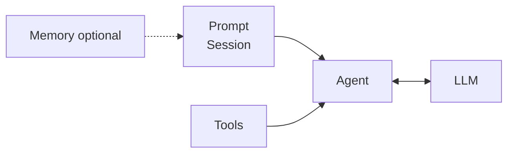

# Core concepts

Language: [简体中文](/zh/guide/concepts) | [日本語](/ja/guide/concepts) | [四川话](/sc/guide/concepts) | English

Three pieces you combine with `LLM` and `Agent`:

| Topic | Page |
|-------|------|
| Messages, system prompt, session history | [Prompt](./prompt) |
| `@tool` and the tool loop | [Tools](./tools) |
| Optional note list you inject by hand | [Memory](./memory) |
