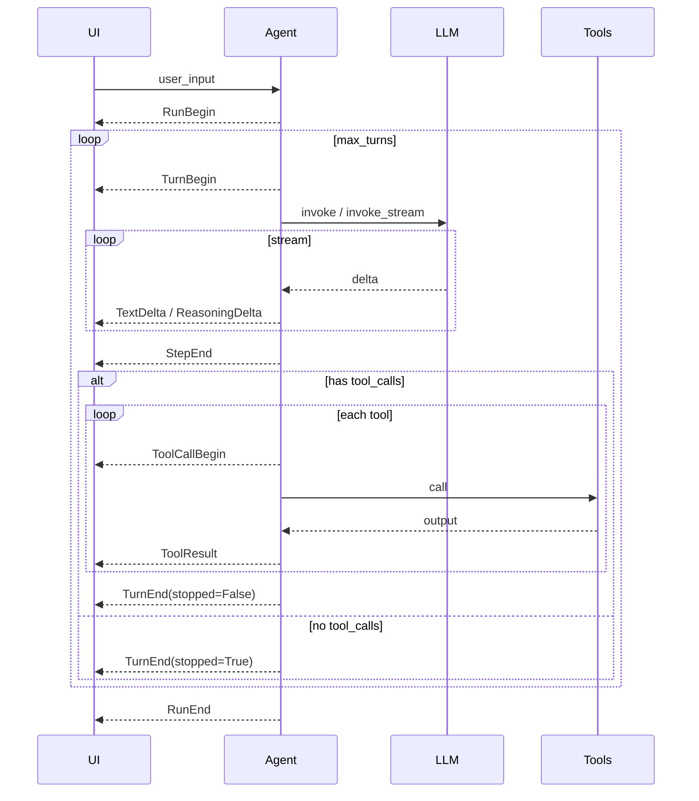

# Agent イベント

言語: 日本語 | [English](/events) | [简体中文](/zh/events) | [四川话](/sc/events)

カスタム UI を組む開発者向け。初めての方は [クイックスタート](./guide/quick-start)、内部実装は [開発者ガイド](./development)。

Agent ループを観察するための構造化イベント。特定 UI（ターミナル、Web、IDE）に結合しません。Kimi Code の *Soul / Wire* 分離の考え方に近い: ループが**事実を発行**し、クライアントが**購読して描画**します。

**状態:** `Agent.arun_events()` がこれらのイベントを送出。`Agent.arun()` は後方互換のため `TextDelta.text` のみを yield する薄いラッパーです。

## ネイティブ Event と Wire（JSON-RPC）

**同じタイムライン、2 つの形** — 別々のイベント体系ではありません。

| 層 | 得られるもの | 典型的な用途 |
|----|-------------|--------------|
| **ネイティブ `Event`** | 凍結 dataclass（`TextDelta`, `RunEnd` など） | Python サービス、CLI、テスト、ノートブック — `match` / `isinstance`、IDE 型 |
| **Wire（JSON-RPC）** | 1 イベント 1 行 NDJSON: `{"jsonrpc":"2.0","method":"TextDelta","params":{...}}` | ブラウザ/モバイル、他言語、SSE/WebSocket、ログ（`wire.jsonl`） |

| API | 戻り値 |
|-----|--------|
| `agent.run()` | 最終 `RunEnd` のみ（ブロック、ストリームなし） |
| `agent.arun()` | `str` テキストチャンクのみ |
| `agent.arun_events()` | **`Event`** オブジェクト（フルストリーム） |
| `agent.arun_wire()` | **`str`** NDJSON 行（同じストリームのシリアライズ） |

Wire は `arun_events()` の薄いシリアライザ。[Wire](./wire) を参照。Python からソケットへ自分で送る場合は `encode_event_line(event)` も使えます。

**ネイティブ** — 消費側が Python で型チェック・パターンマッチが欲しいとき。

**Wire** — 消費側が Python でない、または HTTP/SSE/WebSocket 向けの安定したオンザワイヤ形式が欲しいとき。

## インポート

```python
from pagent import (
    Event,
    RunBegin,
    TurnBegin,
    TextDelta,
    ReasoningDelta,
    StepEnd,
    ToolCallBegin,
    ToolResult,
    TurnEnd,
    RunEnd,
)
```

`Event` は具象イベントクラスの和型（`match` / `isinstance` 用）。

## イベント一覧

### ライフサイクル

| イベント | フィールド | タイミング（想定） |
|----------|-----------|-------------------|
| `RunBegin` | `user_input: str` | ユーザーメッセージを `session` に追加、ループ開始 |
| `TurnBegin` | `turn: int` | `max_turns` 内の 1 回の LLM 呼び出し開始（0 始まり） |
| `TurnEnd` | `turn: int`, `stopped: bool` | アシスタントメッセージ書き込み完了; `stopped=True` ならこの run ではモデルを再呼び出ししない |
| `RunEnd` | `content`, `tool_calls`, `reasoning_content`, `usage` | `run` / `arun` 全体終了（`LLM.invoke` 戻り値と同型） |

### ストリーミング

| イベント | フィールド | タイミング（想定） |
|----------|-----------|-------------------|
| `TextDelta` | `text: str` | `invoke_stream` からのアシスタント `content` チャンク |
| `ReasoningDelta` | `text: str` | `reasoning_content` チャンク（プロバイダ依存） |

### ステップ境界

| イベント | フィールド | タイミング（想定） |
|----------|-----------|-------------------|
| `StepEnd` | `content`, `tool_calls`, `reasoning_content`, `usage` | 1 LLM ステップ完了（ストリーム組み立て後または単発 `invoke`） |

そのステップの `RunEnd` と同じフィールド。`tool_calls` は OpenAI 形: `[{ "id", "type", "function": { "name", "arguments" } }, ...]`。

### ツール

| イベント | フィールド | タイミング（想定） |
|----------|-----------|-------------------|
| `ToolCallBegin` | `tool_call_id`, `name`, `arguments` | ツール実行直前 |
| `ToolResult` | `tool_call_id`, `name`, `content` | ツール出力を `role: tool` で `session` に追加 |

## 典型的な並び

### 1 ターン、テキストのみ

```text
RunBegin
  TurnBegin(0)
    TextDelta …
    StepEnd(content=…, tool_calls=[])
  TurnEnd(0, stopped=True)
RunEnd
```

### ツール 1 回のあと最終回答

```text
RunBegin
  TurnBegin(0)
    TextDelta …
    StepEnd(…, tool_calls=[…])
    ToolCallBegin(…)
    ToolResult(…)
  TurnEnd(0, stopped=False)
  TurnBegin(1)
    TextDelta …
    StepEnd(…, tool_calls=[])
  TurnEnd(1, stopped=True)
RunEnd
```

### `max_turns` に達しツールが残る場合

最後の `TurnEnd` は `stopped=False` のことがある。最終 `RunEnd` は最後のアシスタントメッセージを反映（`tool_calls` が残る場合あり）。



## 消費例

```python
async for event in agent.arun_events("Hello"):
    match event:
        case TextDelta(text=t):
            print(t, end="", flush=True)
        case ToolCallBegin(name=n):
            print(f"\n[tool {n}]")
        case RunEnd(content=c):
            print(f"\n[done: {c!r}]")
```

テキストだけ欲しい呼び出し元は `arun()` のまま:

```python
async for chunk in agent.arun("Hello"):
    print(chunk, end="")  # str, Event ではない
```

## 設計メモ

- **凍結 dataclass** — イベントは不変スナップショット。キューやログに安全。
- **Wire プロトコル** — JSON-RPC 2.0 通知 + NDJSON: [wire.md](./wire)。`Agent.arun_wire()` または `encode_event_line()`。
- **インバウンド制御**（承認、外部ツール、`steer`）— モデル化していない。別リクエスト型で、 `Event` ではない。
- **Session とイベント** — `session.messages` は LLM API 履歴のまま。イベントは並行する UI タイムライン（Kimi の `context.jsonl` と `wire.jsonl` の対比）。

## ソース

定義: [`src/pagent/events.py`](https://github.com/SyncLionPaw/pagent/blob/main/src/pagent/events.py)

**reasoning_content の例**（run / stream、`--zh` 鶏ウサギ）: [reasoning](./reasoning)
