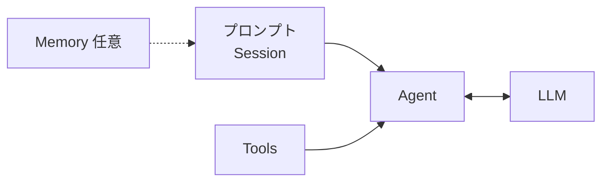

# 基本概念

言語: [日本語](/ja/guide/concepts) | [English](/guide/concepts) | [简体中文](/zh/guide/concepts) | [四川话](/sc/guide/concepts)

`LLM` と `Agent` に組み合わせる三つの部品:

| トピック | ページ |
|----------|--------|
| messages・システムプロンプト・履歴 | [プロンプト](./prompt) |
| `@tool` とツールループ | [ツール](./tools) |
| 手動で混ぜるメモリスト | [メモリ](./memory) |
