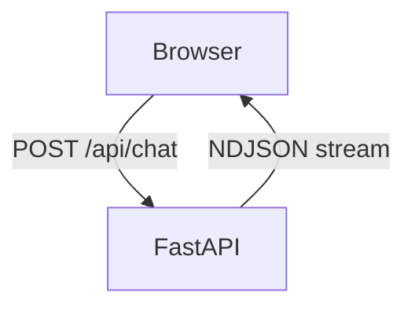
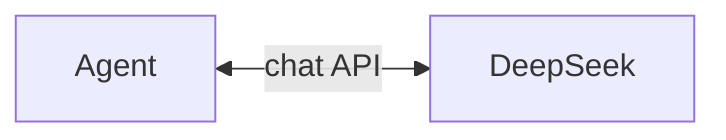
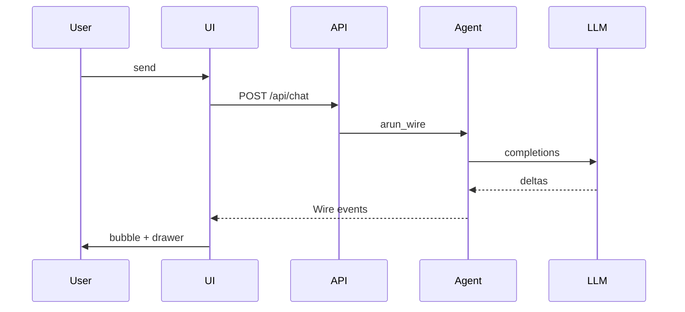
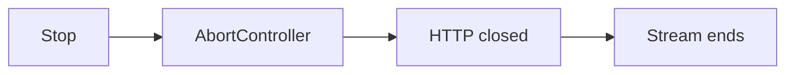

# Wire demo（ローカルブラウザ UI）

言語: 日本語 | [English](/wire-demo) | [简体中文](/zh/wire-demo) | [四川话](/sc/wire-demo)

FastAPI がチャット UI を提供し、ブラウザが **`Agent.arun_wire()`** の `application/x-ndjson` ストリームを消費します。

::: tip GitHub Pages ではデモは動きません
公開サイトは静的ドキュメントのみ。体験するにはローカルでサーバーを起動してください。
:::

## 画面プレビュー


ストリーミング応答、**推論**ブロック、**Wire ログ**ドロワー（`arun_wire()` の JSON-RPC 行）。

## アーキテクチャ

### コンポーネント

#### ブラウザとサーバー



#### FastAPI 内部

`Agent.arun_wire`、ツール、セッション **小帕**：



`GET /` で `index.html` を配信。ブラウザは各行の `method` + `params` を UI / ドロワー用にパースします。

| 部分 | ファイル | 役割 |
|------|----------|------|
| SPA | `static/index.html` | `fetch("/api/chat")`、NDJSON 行を描画 |
| API | `server.py` | `agent.arun_wire(message)` の `StreamingResponse` |
| ライブラリ | `pagent` | Agent ループ、Wire シリアライズ（[プロトコル](./wire)） |

リクエストごとに **新しい** `Agent`（デモ用の簡略化。本番はユーザーごとに session を再利用）。

### リクエストの流れ



ターンや `ToolResult`、`RunEnd` も同じ `A-->>UI` の流れ（[イベント](./events) 参照）。**停止**は fetch の `AbortController` — Wire の `method` ではありません。

### 停止



Wire にキャンセル `method` は **なし** — HTTP ストリームを閉じて停止。

## 起動

例は `uv run` を使用。**uv** が初めての方は [公式ドキュメント](https://docs.astral.sh/uv/) を参照。

```bash
git clone https://github.com/SyncLionPaw/pagent.git
cd pagent
export DEEPSEEK_API_KEY="your-key"

uv run --with fastapi --with uvicorn python examples/wire_browser/server.py
```

ブラウザで **http://127.0.0.1:8765**

## 停止

- **サーバー:** ターミナルで `Ctrl+C`
- **生成中:** UI の **停止**（HTTP リクエストを中断）

## 内容

- チャット UI、ツールカード、思考ブロック（任意）
- サイドドロワーで生の Wire NDJSON
- [Wire プロトコル](./wire) と同じメッセージ体系

ソース: [examples/wire_browser/](https://github.com/SyncLionPaw/pagent/tree/main/examples/wire_browser)
