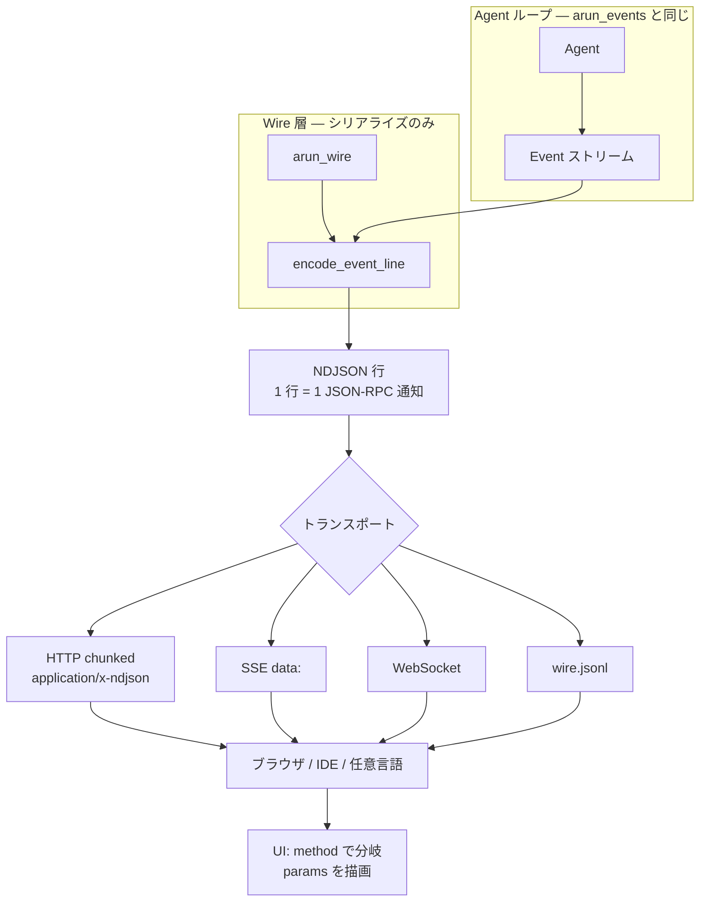
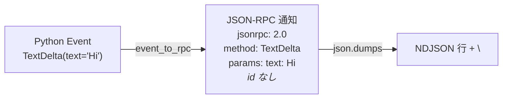
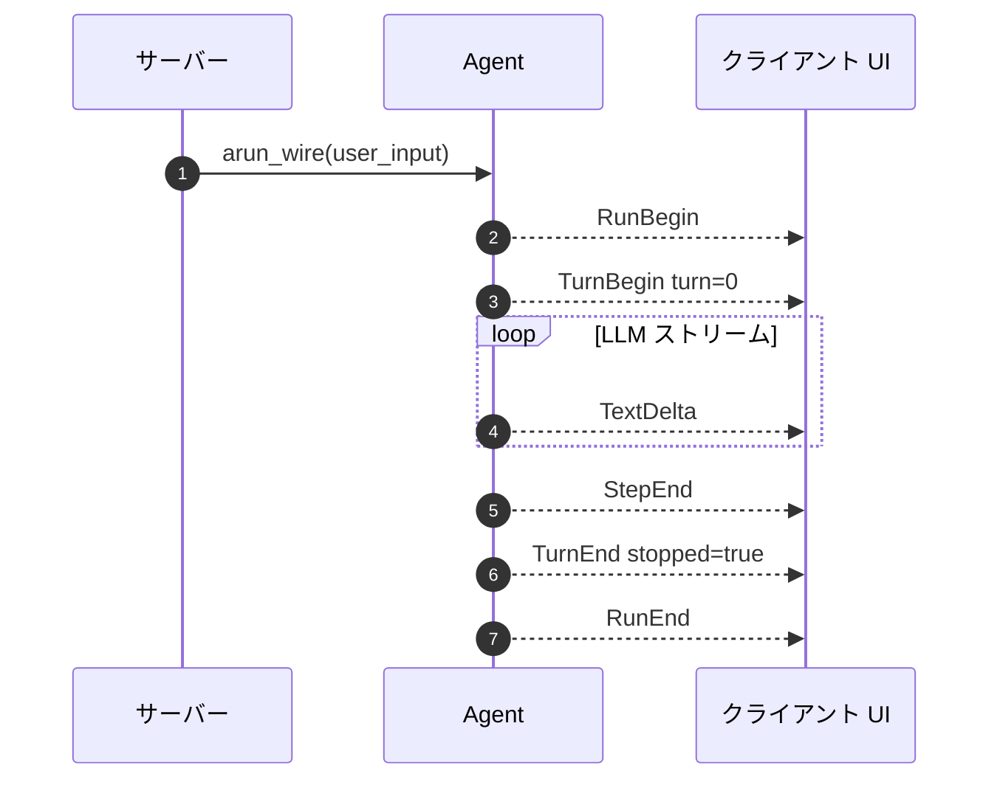
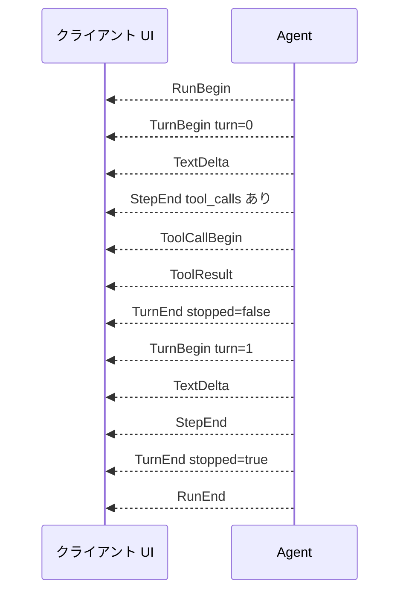

# Wire プロトコル（JSON-RPC 2.0）

言語: 日本語 | [English](/wire) | [简体中文](/zh/wire) | [四川话](/sc/wire)

**Web / モバイルフロント** および JSON 行を扱うトランスポート（HTTP chunked、SSE の `data:`、WebSocket テキストフレーム）向け。

**第 2 のイベント体系ではありません。** `arun_wire()` は `arun_events()` と同じストリームをシリアライズします。意味と順序は [イベント](./events) と一致します。

## Wire のつながり（図）

### 全体：同じタイムライン + シリアライズ層



インバウンド制御（キャンセル、ツール承認）はこの矢印の外 — 独自 API を使用。

### 1 Event → 1 行



### 典型ストリーム（1 ターン、テキストのみ）



### ツールあり（2 ターン）



詳細は [イベント](./events) を参照。

### Wire とネイティブ Event の使い分け

| **Wire**（`arun_wire`, NDJSON） | **ネイティブ Event**（`arun_events`） |
|--------------------------------|--------------------------------------|
| TypeScript / Swift / Kotlin クライアント | Python CLI、FastAPI ハンドラ、テスト |
| ブラウザへ SSE または WebSocket | プロセス内 `match event:` / `isinstance` |
| `wire.jsonl` の保存・再生 | リッチオブジェクト（エンコード前の OpenAI `usage` など） |

| **`arun()`** は回答テキストだけ欲しい単純スクリプト向け。

Python バックエンドがブラウザと話す典型: サーバーループで `arun_events()`、チャンクごとに `encode_event_line(event)` をソケットへ — 行を転送するだけなら `arun_wire()` 直接。

`Agent.arun_events()` の Python イベントは **JSON-RPC 2.0 通知** に 1:1 対応（`id` なし — プッシュでありリクエスト/レスポンスではない）。

## メッセージ形

```json
{
  "jsonrpc": "2.0",
  "method": "TextDelta",
  "params": { "text": "Hello" }
}
```

| フィールド | 値 |
|-----------|-----|
| `jsonrpc` | 常に `"2.0"` |
| `method` | イベントクラス名: `RunBegin`, `TextDelta`, `ToolCallBegin`, `RunEnd`, … |
| `params` | dataclass フィールドの JSON オブジェクト（[イベント](./events) 参照） |

**`id` フィールドはありません。** インバウンド制御（ツール承認、キャンセル）はスコープ外。独自 API で扱ってください。

## NDJSON ストリーム

1 通知 1 行（改行区切り JSON）:

```text
{"jsonrpc":"2.0","method":"RunBegin","params":{"user_input":"Hi"}}
{"jsonrpc":"2.0","method":"TextDelta","params":{"text":"4"}}
{"jsonrpc":"2.0","method":"RunEnd","params":{"content":"4","tool_calls":[],"reasoning_content":"","usage":null}}
```

## Python

```python
from pagent import Agent, LLM, Session, encode_event_line, decode_event_line

async for line in agent.arun_wire("2+2?"):
  # line はすでに NDJSON（末尾 \n）
  send_to_websocket(line)

# 手動エンコード/デコード:
from pagent import event_to_rpc, rpc_to_event

msg = event_to_rpc(TextDelta("x"))
event = rpc_to_event(msg)
```

エクスポート: `event_to_rpc`, `rpc_to_event`, `encode_event`, `decode_event`, `encode_event_line`, `decode_event_line`, `JSONRPC_VERSION`。

## TypeScript 消費者（スケッチ）

```typescript
type WireMsg = { jsonrpc: "2.0"; method: string; params: Record<string, unknown> };

function onLine(line: string) {
  const msg: WireMsg = JSON.parse(line);
  switch (msg.method) {
    case "TextDelta":
      appendAnswer(String(msg.params.text ?? ""));
      break;
    case "ReasoningDelta":
      appendThinking(String(msg.params.text ?? ""));
      break;
    case "ToolCallBegin":
      showTool(msg.params.name as string, msg.params.arguments as string);
      break;
    case "RunEnd":
      finish(msg.params.content as string);
      break;
  }
}
```

## `StepEnd` / `RunEnd` の `usage`

存在する場合、`params.usage` はプレーンオブジェクト:

```json
{ "prompt_tokens": 10, "completion_tokens": 5, "total_tokens": 15 }
```

## メソッド一覧

[イベント](./events) と同じ意味; `method` は Python イベントクラス名と一致。

| `method` | `params` キー |
|----------|----------------|
| `RunBegin` | `user_input` |
| `TurnBegin` | `turn` |
| `TurnEnd` | `turn`, `stopped` |
| `TextDelta` | `text` |
| `ReasoningDelta` | `text` |
| `StepEnd` | `content`, `tool_calls`, `reasoning_content`, `usage` |
| `ToolCallBegin` | `tool_call_id`, `name`, `arguments` |
| `ToolResult` | `tool_call_id`, `name`, `content` |
| `RunEnd` | `content`, `tool_calls`, `reasoning_content`, `usage` |

## 実行可能デモ

[`examples/wire_demo/`](https://github.com/SyncLionPaw/pagent/tree/main/examples/wire_demo) — FastAPI + 単一ページ UI。本サイトの [Wire demo](./wire-demo) を参照。

## ソース

[`src/pagent/wire.py`](https://github.com/SyncLionPaw/pagent/blob/main/src/pagent/wire.py)
