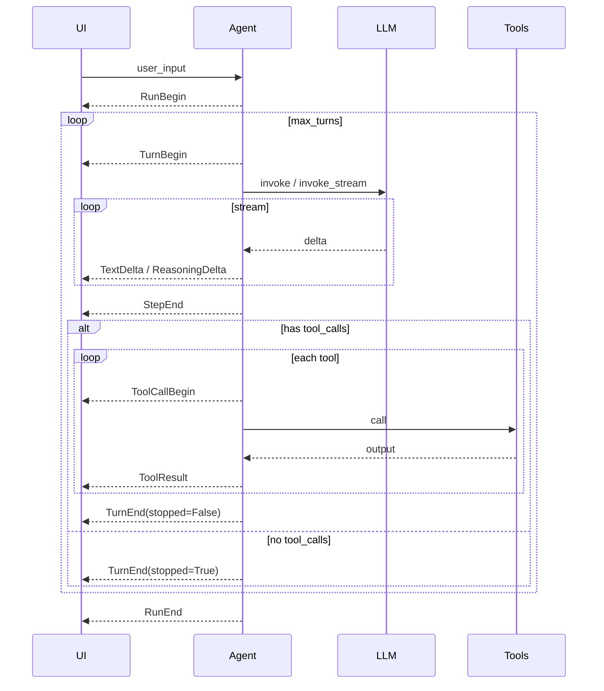

# Agent 事件

语言：四川话 | [English](/events) | [普通话](/zh/events) | [日本語](/ja/events)

要给自定义 UI / 嵌入整活的开发者看。刚入门看 [赶紧上手](/sc/guide/quick-start)；库结构看 [开发指南](./development)。

结构化事件用来**瞅** **Agent 循环**，不绑死某一种 UI（终端、Web、IDE）。思路像 Kimi Code 的 *Soul / Wire* 分开：循环**发出**事实，消费者**订阅**再渲染。

**现状：** `Agent.arun_events()` 会吐这些事件。`Agent.arun()` 是兼容层，只透出 `TextDelta.text`。

## 原生 Event 跟 Wire（JSON-RPC）

**同一条时间线，两种形态** — 不是两套不同的事件系统。

| 层次 | 得到啥子 | 典型场景 |
|------|----------|----------|
| **原生 `Event`** | Python 冻结 dataclass（`TextDelta`、`RunEnd` 等） | Python 服务、CLI、测试、Notebook — `match` / `isinstance` |
| **Wire（JSON-RPC）** | 每行一条 NDJSON：`{"jsonrpc":"2.0","method":"TextDelta","params":{...}}` | 浏览器/手机、其他语言、SSE/WebSocket、落盘 `wire.jsonl` |

| API | 返回 |
|-----|------|
| `agent.run()` | 仅最终 `RunEnd`（非流式） |
| `agent.arun()` | 仅答案文本片段 `str` |
| `agent.arun_events()` | **`Event`** 对象（完整流） |
| `agent.arun_wire()` | **`str`** NDJSON 行（同一流，已序列化） |

Wire 是对 `arun_events()` 的薄序列化，见 [Wire 协议](./wire)。Python 里也可 `encode_event_line(event)` 再发到 socket。

**用原生**：消费端是 Python，要类型跟模式匹配。

**用 Wire**：消费端不是 Python，或者要 HTTP/SSE/WebSocket 上稳定的 JSON 格式。

## 导入

```python
from pagent import (
    Event,
    RunBegin,
    TurnBegin,
    TextDelta,
    ReasoningDelta,
    StepEnd,
    ToolCallBegin,
    ToolResult,
    TurnEnd,
    RunEnd,
)
```

`Event` 是所有具体事件类的联合类型，方便 `match` / `isinstance`。

## 事件说明

### 生命周期

| 事件 | 字段 | 时机（设计意图） |
|------|------|------------------|
| `RunBegin` | `user_input: str` | 用户消息已写入 `session`，开始本轮 |
| `TurnBegin` | `turn: int` | `max_turns` 内开始一次模型调用（从 0 计） |
| `TurnEnd` | `turn: int`, `stopped: bool` | 助手消息已写入；`stopped=True` 表示本次 run 不再喊模型 |
| `RunEnd` | `content`, `tool_calls`, `reasoning_content`, `usage` | 整次 `run` / `arun` 结束（跟 `LLM.invoke` 返回值同类型） |

### 流式片段

| 事件 | 字段 | 时机（设计意图） |
|------|------|------------------|
| `TextDelta` | `text: str` | `invoke_stream` 返回的 assistant `content` 片段 |
| `ReasoningDelta` | `text: str` | `reasoning_content` 片段（看 Provider） |

### 单步边界

| 事件 | 字段 | 时机（设计意图） |
|------|------|------------------|
| `StepEnd` | `content`, `tool_calls`, `reasoning_content`, `usage` | 一次 LLM 调用结束（流式拼完或单次 `invoke`） |

字段跟 `RunEnd` 一样。`tool_calls` 是 OpenAI 形状：`[{ "id", "type", "function": { "name", "arguments" } }, ...]`。

### 工具

| 事件 | 字段 | 时机（设计意图） |
|------|------|------------------|
| `ToolCallBegin` | `tool_call_id`, `name`, `arguments` | 马上要执行某个工具 |
| `ToolResult` | `tool_call_id`, `name`, `content` | 工具结果以 `role: tool` 写入 `session` |

## 典型顺序

### 单轮，仅文本

```text
RunBegin
  TurnBegin(0)
    TextDelta …
    StepEnd(content=…, tool_calls=[])
  TurnEnd(0, stopped=True)
RunEnd
```

### 先调工具，再给最终回复

```text
RunBegin
  TurnBegin(0)
    TextDelta …
    StepEnd(…, tool_calls=[…])
    ToolCallBegin(…)
    ToolResult(…)
  TurnEnd(0, stopped=False)
  TurnBegin(1)
    TextDelta …
    StepEnd(…, tool_calls=[])
  TurnEnd(1, stopped=True)
RunEnd
```

### 到 `max_turns` 还有未处理工具

最后一次 `TurnEnd` 可能 `stopped=False`；最后 `RunEnd` 就是最后一条助手消息（可能还带 `tool_calls`）。



## 消费者例子

```python
async for event in agent.arun_events("你好嘛"):
    match event:
        case TextDelta(text=t):
            print(t, end="", flush=True)
        case ToolCallBegin(name=n):
            print(f"\n[工具 {n}]")
        case RunEnd(content=c):
            print(f"\n[结束: {c!r}]")
```

只要文本的继续用 `arun()`：

```python
async for chunk in agent.arun("你好嘛"):
    print(chunk, end="")  # str，不是 Event
```

## 设计说明

- **不可变 dataclass** — 事件是快照，可入队或写日志。
- **Wire 协议** — JSON-RPC 2.0 通知 + NDJSON：[wire.md](./wire)。可用 `Agent.arun_wire()` 或 `encode_event_line()`。
- **进站控制**（审批、外部工具、中途 `steer`）— 没建模；以后应是单独的 request 类型，不属于 `Event`。
- **Session 跟事件** — `session.messages` 还是给模型的 API 历史；事件是平行的 UI 时间线（类比 Kimi 的 `context.jsonl` 跟 `wire.jsonl`）。

## 源码

[`src/pagent/events.py`](https://github.com/SyncLionPaw/pagent/blob/main/src/pagent/events.py)

**reasoning_content 例子**（非流式/流式、`--zh` 鸡兔同笼）：[脑壳转](./reasoning)
