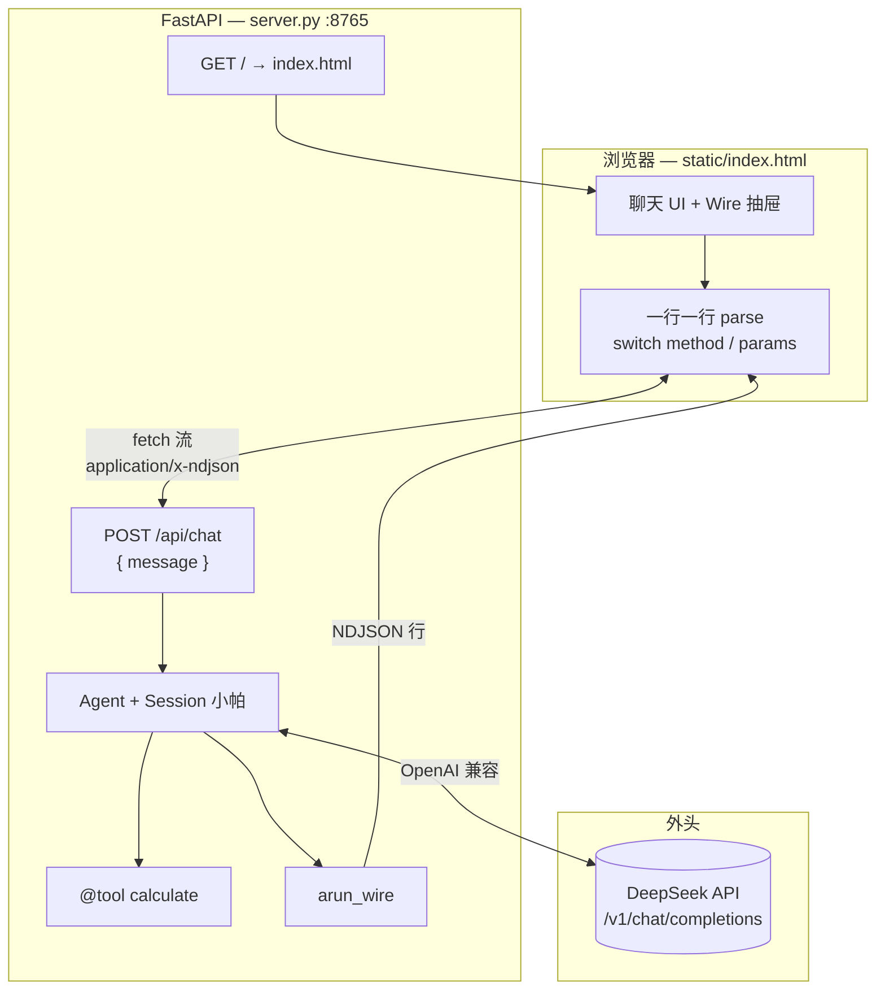
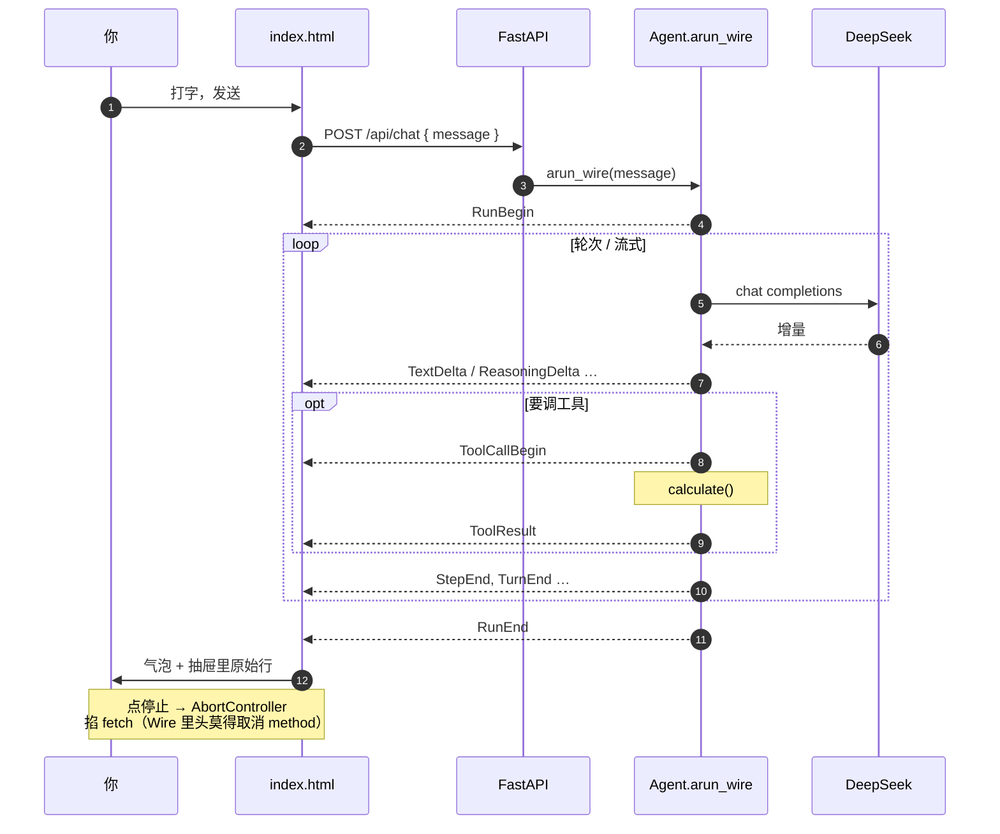
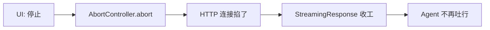

# Wire demo（本地浏览器 UI）

语言：四川话 | [English](/wire-demo) | [普通话](/zh/wire-demo) | [日本語](/ja/wire-demo)

全栈例子：**FastAPI** 摆聊天页，浏览器吃 **`Agent.arun_wire()`** 的 `application/x-ndjson` 流，亲眼瞅流式对话，巴适。

::: tip 在线文档站代替不了本地 demo
GitHub Pages 只托管静态文档。要体验流式对话，本地把服务扯起来嘛，不存在在线版哈。
:::

## 架构图（啷个串起的）

### 几块板子



| 哪块 | 文件 | 干啥子 |
|------|------|--------|
| 前端 | `static/index.html` | `fetch("/api/chat")`，按行吃 Wire，画气泡 / 工具 / 脑壳转 |
| 后端 | `server.py` | `StreamingResponse`，`agent.arun_wire(message)` 吐行 |
| 库 | `pagent` | Agent 循环，事件变 Wire（[协议](./wire)） |

每发一条消息就 **新整** 一个 `Agent`（demo 图撇脱；正经产品要按用户把 session **经佑** 起）。

### 发一句的流程



### 咋个停



停生成靠 **断 HTTP**，Wire 协议本身不管取消；批工具这个 demo 也没做，莫搞混了哈。

## 跑起来（莫等了，搞起）

用 `uv run` 跑示例；**不晓得 uv 是啥子** 的先到 [这儿看](https://docs.astral.sh/uv/)哈。

```bash
git clone https://github.com/SyncLionPaw/pagent.git
cd pagent
export DEEPSEEK_API_KEY="your-key"

uv run --with fastapi --with uvicorn python examples/wire_demo/server.py
```

浏览器开 **http://127.0.0.1:8765**，要得不？终端窗口 **看到起**，别关错了哈。

## 咋个停

- **服务：** 终端里 `Ctrl+C`，刹割，收工归一。
- **生成中：** 点界面上的 **停止**（把 HTTP 请求掐了），莫在那儿打晃晃。

## 演示些啥子

- 聊天气泡、工具卡片、可折叠脑壳转区
- 右边抽屉看原始 Wire NDJSON 行
- 跟 [Wire 协议](./wire) 一套，莫得另一套消息系统，莫听人扯把子

源码：[examples/wire_demo/](https://github.com/SyncLionPaw/pagent/tree/main/examples/wire_demo)
