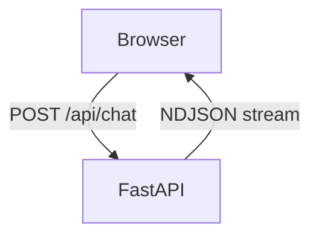
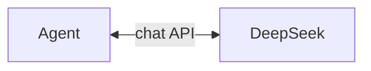
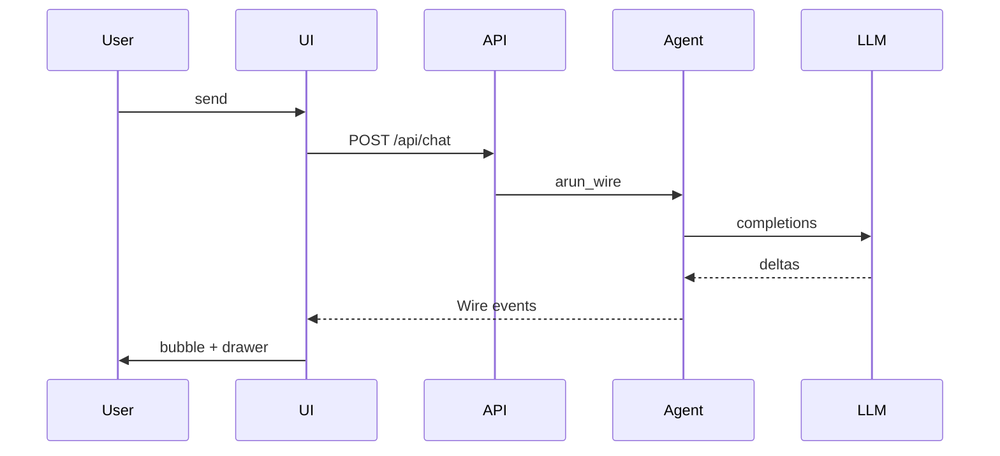
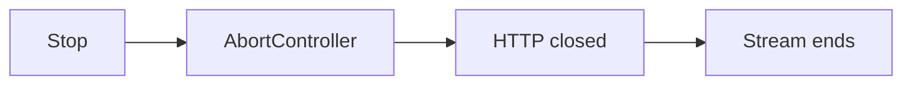

# Wire demo (local browser UI)

Language: [简体中文](/zh/wire-demo) | [日本語](/ja/wire-demo) | [四川话](/sc/wire-demo) | English

Full-stack example: **FastAPI** serves a chat UI; the browser consumes **`Agent.arun_wire()`** as `application/x-ndjson`.

::: tip GitHub Pages cannot host the live demo
The docs site is static only. Run the server locally to try streaming chat.
:::

## Preview


Streaming reply, optional **reasoning** block, and **Wire log** drawer (JSON-RPC lines from `arun_wire()`).

## Architecture

### Components

#### Browser and server



#### Inside FastAPI

`Agent.arun_wire`, tools, session **小帕**:



`GET /` serves `index.html`. The browser parses each Wire line (`method` + `params`) for the UI and drawer.

| Piece | File | Role |
|-------|------|------|
| SPA | `static/index.html` | `fetch("/api/chat")`, read NDJSON lines, render bubbles / tools / reasoning |
| API | `server.py` | `StreamingResponse` from `agent.arun_wire(message)` |
| Library | `pagent` | Agent loop, events → JSON-RPC Wire ([protocol](./wire)) |

Each chat request creates a **new** `Agent` (demo simplicity; a real app would reuse session per user).

### Request flow



Turns, `TextDelta` / `ToolResult`, and `RunEnd` are more events on the same `A-->>UI` arrow (see [events](./events)). **Stop** uses `AbortController` on fetch — not a Wire `method`.

### Cancel / stop



Wire has **no** cancel `method` — stopping generation closes the HTTP stream. Tool approval is also out of scope in this demo.

## Run

Examples use `uv run`. New to **uv**? See the [official docs](https://docs.astral.sh/uv/).

```bash
git clone https://github.com/SyncLionPaw/pagent.git
cd pagent
export DEEPSEEK_API_KEY="your-key"

uv run --with fastapi --with uvicorn python examples/wire_demo/server.py
```

Open **http://127.0.0.1:8765**

## Stop

- **Server:** `Ctrl+C` in the terminal
- **While streaming:** click **停止** in the UI (aborts the HTTP request)

## What it shows

- Chat UI with tool cards and optional reasoning block
- Side drawer with raw Wire NDJSON lines
- Same protocol as [Wire protocol](./wire) — not a separate message system

Source: [examples/wire_demo/](https://github.com/SyncLionPaw/pagent/tree/main/examples/wire_demo) on GitHub.
