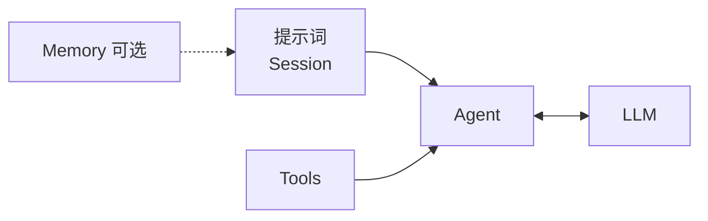

# 核心概念

语言： [中文](/zh/guide/concepts) | [English](/guide/concepts) | [日本語](/ja/guide/concepts) | [四川话](/sc/guide/concepts)

和 `LLM`、`Agent` 拼在一起的三块：

| 主题 | 文档 |
|------|------|
| messages、系统提示、对话历史 | [提示词](./prompt) |
| `@tool` 与工具循环 | [工具](./tools) |
| 可选备注列表，手动注入 | [记忆](./memory) |
