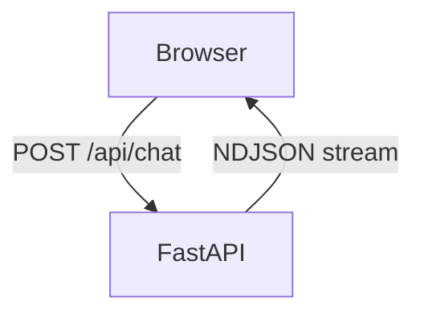
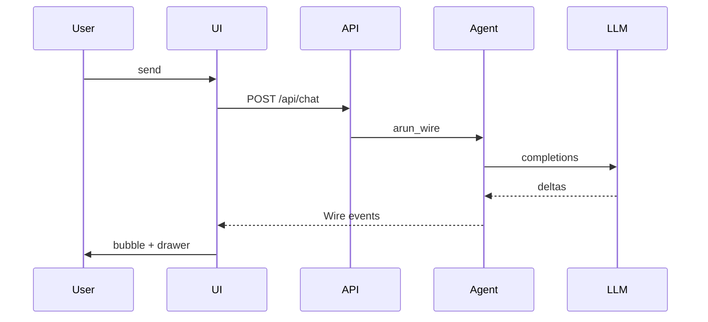

# Wire demo（本地浏览器 UI）

语言：中文 | [English](/wire-demo) | [日本語](/ja/wire-demo) | [四川话](/sc/wire-demo)

全栈示例：**FastAPI** 提供聊天页，浏览器消费 **`Agent.arun_wire()`** 的 `application/x-ndjson` 流。

::: tip 在线文档站不能代替本地 demo
GitHub Pages 只托管静态文档。要体验流式对话，请在本地启动服务。
:::

## 界面预览


流式回复、**思考过程**折叠块，以及 **Wire 日志** 抽屉（`arun_wire()` 吐出的 JSON-RPC 行）。

## 架构图

### 组件

#### 浏览器与服务端



#### FastAPI 内部

`Agent.arun_wire`、工具、会话 **小帕**：


`GET /` 提供 `index.html`。浏览器按 Wire 行解析 `method` + `params`，用于 UI 与抽屉。

| 部分 | 文件 | 作用 |
|------|------|------|
| 前端 | `static/index.html` | `fetch("/api/chat")`，逐行解析，渲染气泡 / 工具 / 思考 |
| 后端 | `server.py` | `StreamingResponse`，来自 `agent.arun_wire(message)` |
| 库 | `pagent` | Agent 循环，事件 → Wire（[协议](./wire)） |

每次聊天请求会 **新建** 一个 `Agent`（demo 图简单；正式产品应按用户复用 session）。

### 一次对话的流程



多轮、`TextDelta` / `ToolResult`、`RunEnd` 仍是同一方向的 Wire 行（见 [事件流](./events)）。**停止** 用 `AbortController` 中断 fetch，不是 Wire `method`。

### 停止生成


Wire **没有** 取消类 `method` — 停止靠断开 HTTP。工具审批本 demo 也不做。

## 运行

示例使用 `uv run`。不了解 **uv** 可看 [官方文档](https://docs.astral.sh/uv/)。

```bash
git clone https://github.com/SyncLionPaw/pagent.git
cd pagent
export DEEPSEEK_API_KEY="your-key"

uv run --with fastapi --with uvicorn python examples/wire_demo/server.py
```

浏览器打开 **http://127.0.0.1:8765**

## 停止

- **服务：** 终端里 `Ctrl+C`
- **生成中：** 点击界面上的 **停止**（中断 HTTP 请求）

## 演示内容

- 聊天气泡、工具卡片、可折叠思考区
- 右侧抽屉查看原始 Wire NDJSON 行
- 与 [Wire 协议](./wire) 相同，不是另一套消息系统

源码：[examples/wire_demo/](https://github.com/SyncLionPaw/pagent/tree/main/examples/wire_demo)
