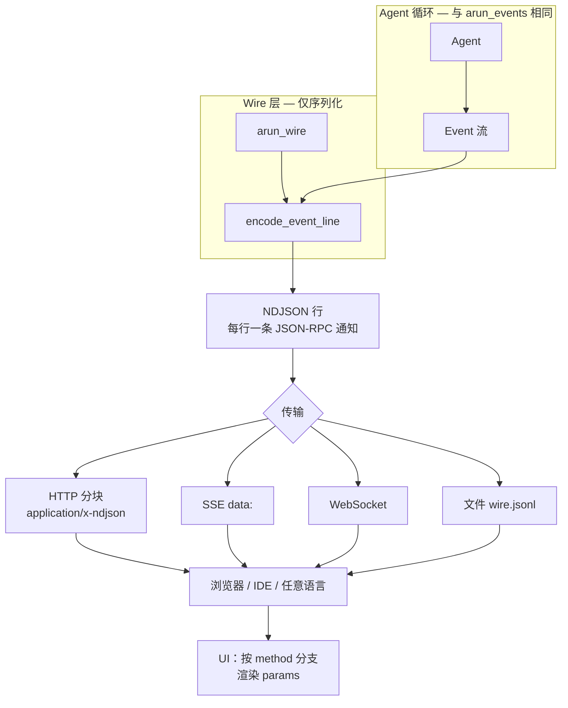
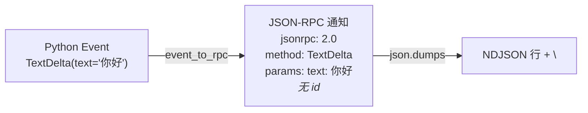
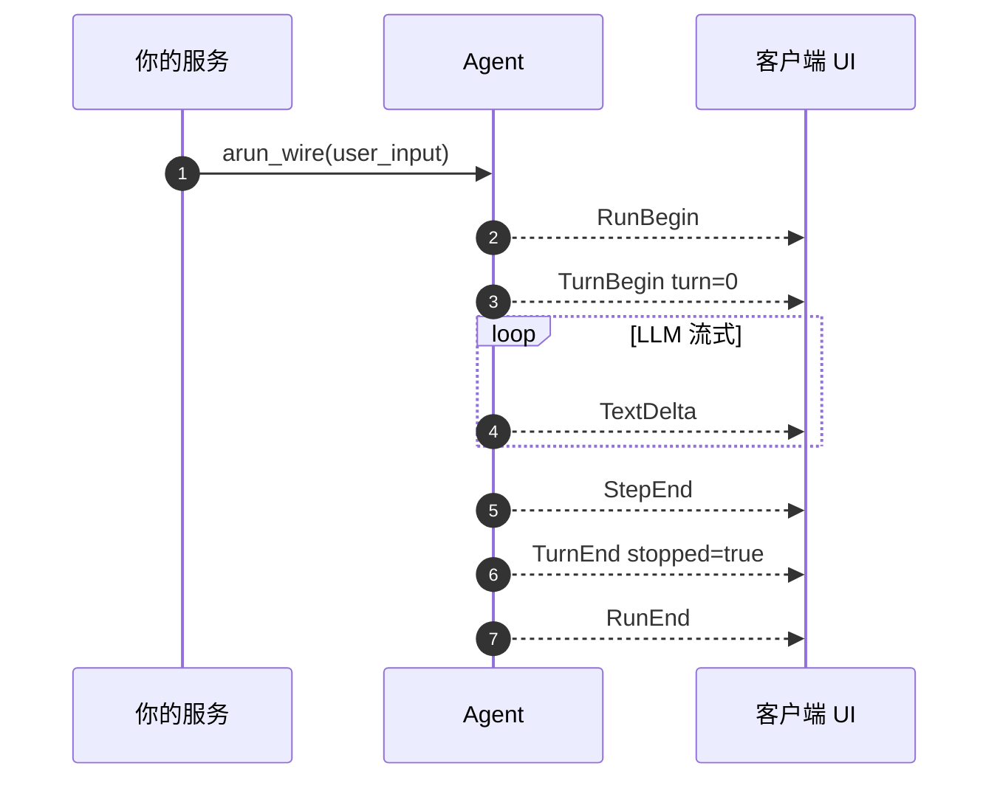
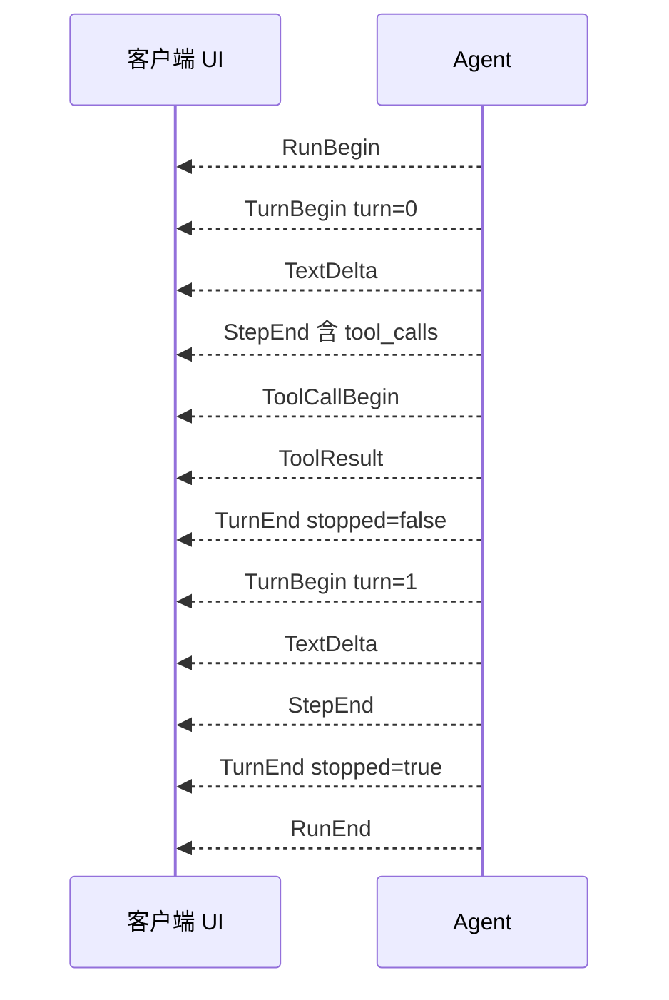

# Wire 协议（JSON-RPC 2.0）

语言：中文 | [English](/wire) | [日本語](/ja/wire) | [四川话](/sc/wire)

面向 **Web / 移动端** 以及任何用 JSON 行传输的场景（HTTP 分块、SSE 的 `data:`、WebSocket 文本帧）。

**不是第二套事件系统。** `arun_wire()` 序列化的流与 `arun_events()` 相同；语义与顺序见 [事件流](./events)。

## Wire 怎么接上（图示）

### 整体：同一时间线，多一层序列化



入站控制（取消、工具审批、steer）**不走**这条箭头，请用你自己的 HTTP/API。

### 一个 Event → 一行



### 典型流（单轮，仅文本）



### 带工具（两轮）



完整事件说明见 [事件流](./events)。

### 何时用 Wire、何时用原生 Event

| 用 **Wire**（`arun_wire`、NDJSON） | 用 **原生 Event**（`arun_events`） |
|-----------------------------------|----------------------------------|
| TypeScript / 移动端等非 Python 客户端 | Python CLI、服务内处理、单元测试 |
| 经 SSE / WebSocket 推到浏览器 | 进程内 `match` / `isinstance` |
| 落盘或回放 `wire.jsonl` | 需要编码前的完整对象（如 `usage` 原始类型） |

| 仅需打印答案文本、不关心工具/轮次时，用 **`arun()`** 即可。

Python 服务对接浏览器时常见写法：内部 `arun_events()`，对每个事件 `encode_event_line(event)` 写入连接；若只转发、不在 Python 侧分支处理，可直接 `arun_wire()`。

`Agent.arun_events()` 产出的 Python 事件与 **JSON-RPC 2.0 通知** 一一对应（无 `id`，单向推送，不是请求/响应）。

## 消息格式

```json
{
  "jsonrpc": "2.0",
  "method": "TextDelta",
  "params": { "text": "你好" }
}
```

| 字段 | 含义 |
|------|------|
| `jsonrpc` | 固定 `"2.0"` |
| `method` | 事件名：`RunBegin`、`TextDelta`、`ToolCallBegin`、`RunEnd` 等 |
| `params` | 字段对象（语义见 [事件流](./events)） |

**没有** `id`。入站控制（审批工具、取消）不在本协议内，请用你自己的 API。

## NDJSON 流

每行一条通知：

```text
{"jsonrpc":"2.0","method":"RunBegin","params":{"user_input":"你好"}}
{"jsonrpc":"2.0","method":"TextDelta","params":{"text":"5"}}
{"jsonrpc":"2.0","method":"RunEnd","params":{"content":"5","tool_calls":[],"reasoning_content":"","usage":null}}
```

## Python

```python
from pagent import Agent, LLM, Session

async for line in agent.arun_wire("2+3?"):
    # line 已是 NDJSON（末尾带 \n）
    websocket.send(line)

# 手动编解码：
from pagent import encode_event_line, decode_event_line, event_to_rpc, rpc_to_event
```

导出：`event_to_rpc`、`rpc_to_event`、`encode_event`、`decode_event`、`encode_event_line`、`decode_event_line`、`JSONRPC_VERSION`。

## TypeScript 消费示例

```typescript
type WireMsg = { jsonrpc: "2.0"; method: string; params: Record<string, unknown> };

function onLine(line: string) {
  const msg: WireMsg = JSON.parse(line);
  switch (msg.method) {
    case "TextDelta":
      appendAnswer(String(msg.params.text ?? ""));
      break;
    case "ReasoningDelta":
      appendThinking(String(msg.params.text ?? ""));
      break;
    case "ToolCallBegin":
      showTool(msg.params.name as string, msg.params.arguments as string);
      break;
    case "RunEnd":
      finish(msg.params.content as string);
      break;
  }
}
```

## `usage` 字段

`StepEnd` / `RunEnd` 的 `params.usage` 为普通对象（若有）：

```json
{ "prompt_tokens": 10, "completion_tokens": 5, "total_tokens": 15 }
```

## method 一览

与 [事件流](./events) 相同；`method` 即 Python 事件类名。

| `method` | `params` 字段 |
|----------|----------------|
| `RunBegin` | `user_input` |
| `TurnBegin` | `turn` |
| `TurnEnd` | `turn`, `stopped` |
| `TextDelta` | `text` |
| `ReasoningDelta` | `text` |
| `StepEnd` | `content`, `tool_calls`, `reasoning_content`, `usage` |
| `ToolCallBegin` | `tool_call_id`, `name`, `arguments` |
| `ToolResult` | `tool_call_id`, `name`, `content` |
| `RunEnd` | `content`, `tool_calls`, `reasoning_content`, `usage` |

## 可运行示例

[`examples/wire_demo/`](https://github.com/SyncLionPaw/pagent/tree/main/examples/wire_demo) — FastAPI + 单页 UI。本站说明：[Wire demo](./wire-demo)。

## 源码

[`src/pagent/wire.py`](https://github.com/SyncLionPaw/pagent/blob/main/src/pagent/wire.py)
